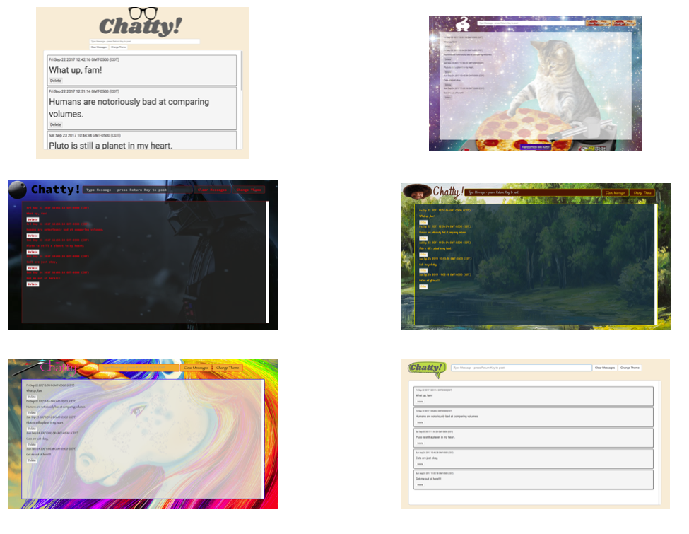

# Chatty Group Project

## Project Requirements Included:
* Use Bootstrap
* Complete 1 of the bonus items
* Balanced github contributions
* Completed Readme
* No grunt errors
* Use Browserify to create modules for the various functions

## Functionality Requirements

1. 5 preloaded messages should appear in the message area when the page first loads
2. Create an input field for a user to enter a message.
3. When the return key is pressed in the message field, create a new message
4. Create a button to clear all messages, if there are no messages, the button should be disabled
5. Messages should be displayed with a "Delete" button after it
6. Give the user one additional theme choice for the interface
---
Using javascript, we created a "chat app" where the user can enter a message and have it displayed to the main text area. We also focused on creating engaging themes for our users to choose from since we know there is no "one size fits all" chat app!

## Stetch Goals
- [x] Additional themes
- [x] Incorporate multiple JSON files
- [x] Emojis
- [x] Timestamps on messages
- [ ] Multiple users
- [ ] Editing messages
- [x] Message limit

## Final Product

A look at our 6 theme choices:


## How to Run it
Must have Node installed
```
git clone https://github.com/nss-evening-cohort-06/chatty-better-than-butter
cd chatty-better-than-butter/lib/
npm install
cd ../
npm install http-server -g
http-server -p 8080
```

This will show up in your browser at:
`http://localhost:8080`

## Contributors: 
[Jessica Brawner](https://github.com/lady-ace "lady-ace on Github")
[Adam Smith](https://github.com/hagansmith "hagansmith on Github")
[Amber Staurt](https://github.com/waamber "waamber on GitHub")
[Alex Sanchez](https://github.com/alexsanchez728 "alexsanchez728 on Github")